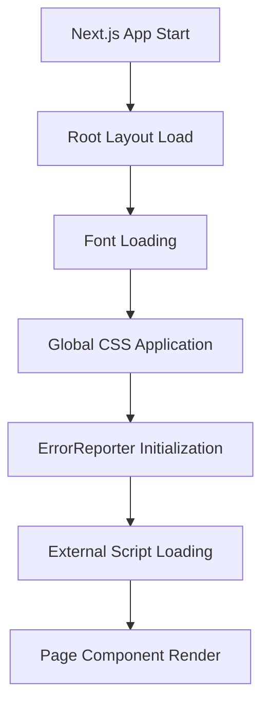
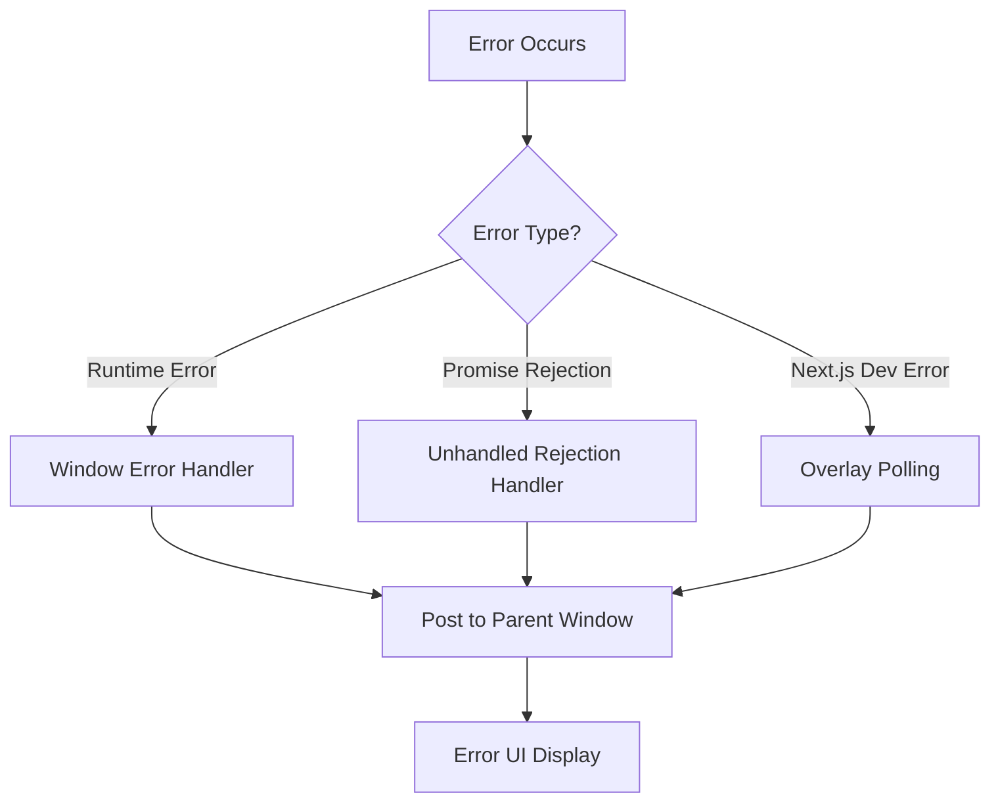
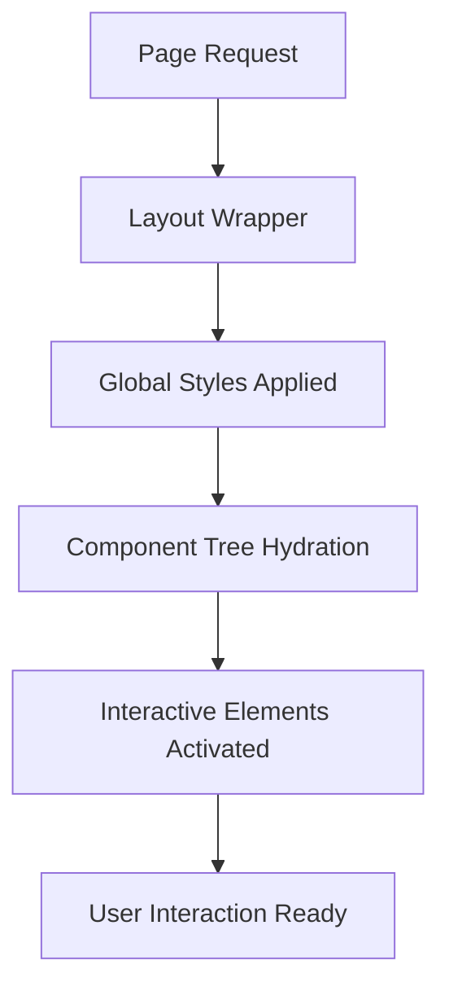

# StarkRender Frontend - React + Tailwind

This documentation explains the architecture and flow of the StarkRender frontend application, a modern React-based web application built with Next.js and styled with Tailwind CSS.

## Table of Contents

- [Project Overview](#project-overview)
- [Architecture](#architecture)
- [Key Components](#key-components)
- [Application Flow](#application-flow)
- [Styling System](#styling-system)
- [Build and Deployment](#build-and-deployment)
- [Development Workflow](#development-workflow)

## Project Overview

StarkRender Frontend is a Next.js 15 application that provides a modern, responsive user interface. The application has been cleaned up from its previous Orchids visual editing integration and now focuses on providing a streamlined user experience.

### Tech Stack

- **Framework**: Next.js 15.4.5
- **Language**: TypeScript
- **Styling**: Tailwind CSS with custom design system
- **UI Components**: Radix UI primitives + Custom components
- **Icons**: Tabler Icons React
- **Animation**: Framer Motion
- **Package Manager**: Bun (with npm fallback)

## Architecture

The application follows a standard Next.js App Router architecture:

```
src/
├── app/                    # App Router pages and layouts
│   ├── globals.css        # Global styles and Tailwind configuration
│   ├── layout.tsx         # Root layout component
│   ├── page.tsx           # Home page component
│   └── favicon.ico        # Application favicon
├── components/            # Reusable UI components
│   ├── ui/               # Base UI components (Radix + custom)
│   ├── magicui/          # Specialized UI components
│   └── [Feature Components] # Page-specific components
└── lib/                  # Utility functions and configurations
    └── utils.ts          # Common utility functions
```

## Key Components

### Root Layout (`src/app/layout.tsx`)

The root layout component that wraps all pages and provides:

- **Font Configuration**: Geist Sans and Geist Mono fonts
- **Global Styling**: Dark theme support and base CSS classes
- **Error Handling**: ErrorReporter component for graceful error handling
- **External Scripts**: Route messaging script for iframe communication
- **Metadata**: SEO and document metadata configuration

### Error Handling (`src/components/ErrorReporter.tsx`)

A comprehensive error reporting system that:

- **Captures Runtime Errors**: Handles window.onerror and unhandled promise rejections
- **Dev Overlay Integration**: Monitors Next.js development overlay for errors
- **Iframe Communication**: Posts error information to parent windows when embedded
- **User-Friendly UI**: Provides a clean error interface for production errors
- **Development Details**: Shows detailed error information in development mode

### UI Component System

The application uses a layered component architecture:

1. **Base Components** (`src/components/ui/`): Radix UI primitives with custom styling
2. **Magic UI** (`src/components/magicui/`): Specialized components like marquee
3. **Feature Components**: Page-specific business logic components

#### Key UI Components:

- **BentoGrid**: Grid layout system for content organization
- **HeroSection**: Landing page hero section
- **IntegrationSection**: Service integration showcase
- **StatsSection**: Statistics display component
- **TestimonialSection**: Customer testimonials
- **Footer**: Application footer with links and information
- **Marquee**: Animated scrolling text component

## Application Flow

### 1. Application Bootstrap



### 2. Error Handling Flow



### 3. Component Rendering Flow



## Styling System

The application uses a sophisticated Tailwind CSS setup with:

### Custom Design Tokens

- **CSS Variables**: Defined in `globals.css` for consistent theming
- **Dark Mode Support**: Automatic dark theme with `dark` class
- **Custom Variants**: Special variants for enhanced styling control
- **Component Themes**: Inline theme definitions for specific use cases

### Tailwind Configuration

- **Custom Colors**: Brand-specific color palette
- **Typography Scale**: Consistent font sizing and spacing
- **Border Radius**: Standardized border radius values
- **Shadow System**: Layered shadow system for depth

### Component Styling Strategy

1. **Base Styles**: Applied through Tailwind utility classes
2. **Variant Classes**: Using `class-variance-authority` for component variants
3. **Conditional Styling**: Dynamic classes based on component state
4. **Responsive Design**: Mobile-first responsive utilities

## Build and Deployment

### Development Build

```bash
# Start development server with Turbopack
npm run dev
# or
bun dev
```

### Production Build

```bash
# Build for production
npm run build

# Start production server
npm run start
```

### Build Configuration

- **Next.js Config**: Optimized for production with image optimization
- **TypeScript**: Full type checking enabled
- **Turbopack**: Development mode optimization
- **Static Generation**: Pages pre-rendered where possible

### Docker Support

The application includes Docker configuration for containerized deployment:

- **Multi-stage Build**: Optimized for production size
- **Security**: Non-root user configuration
- **Efficient Caching**: Layer optimization for faster builds

## Development Workflow

### 1. Component Development

```typescript
// Example component pattern
import { ComponentProps } from "./types";
import { cn } from "@/lib/utils";

export function MyComponent({ className, ...props }: ComponentProps) {
  return (
    <div className={cn("base-styles", className)} {...props}>
      {/* Component content */}
    </div>
  );
}
```

### 2. Styling Workflow

1. **Use Existing Components**: Check `src/components/ui/` first
2. **Extend Base Components**: Add variants using CVA
3. **Create New Components**: Follow established patterns
4. **Apply Responsive Design**: Use Tailwind responsive prefixes

### 3. Error Handling Best Practices

- **Boundary Components**: Use React Error Boundaries where appropriate
- **Graceful Degradation**: Provide fallback UI for failed states
- **User Feedback**: Clear error messages and recovery actions
- **Logging**: Comprehensive error reporting for debugging

### 4. Performance Considerations

- **Code Splitting**: Automatic with Next.js App Router
- **Image Optimization**: Next.js Image component with remote pattern support
- **Font Optimization**: Automatic font loading optimization
- **Static Generation**: Pre-render content where possible

## Key Features

1. **Modern Architecture**: App Router with React Server Components
2. **Type Safety**: Full TypeScript implementation
3. **Responsive Design**: Mobile-first approach with Tailwind
4. **Accessibility**: Radix UI components with built-in a11y
5. **Performance**: Optimized builds and loading strategies
6. **Error Resilience**: Comprehensive error handling and reporting
7. **Developer Experience**: Hot reloading, type checking, and modern tooling

## Next Steps

For further development:

1. **Add New Pages**: Create new routes in the `src/app/` directory
2. **Extend Components**: Build upon the existing UI component library
3. **Customize Styling**: Modify Tailwind configuration for brand requirements
4. **Integrate APIs**: Add data fetching and state management as needed
5. **Testing**: Implement unit and integration tests
6. **Analytics**: Add tracking and monitoring capabilities

This architecture provides a solid foundation for scalable React applications with modern development practices and user experience considerations.
